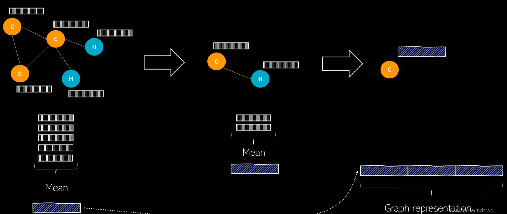

### A Graph Neuronal Network project on HIV data. 

This datset contains about 40,000 molecules in SMILES format Binary lavel if a specific molecule inhibit HIV

## Project overview: 

- Building a Custom Dataset in Pytorch Geometric. 
We create our own dataset. We inherate from Dataset class from torch_geometric. 
`dataset.py`

- Building a Graph Neural Network
Input: Molecule with nodes, edges features... from dataset.py
GNN: apply
Output: Update node embeddings with information about neighborhood and about the whole class. In our case are classification specific. Yes or No predictions. 

## Embedding. Why and How. 
#### Why embedding? 
- Similarity of embedding between nodes indicates their similiraty in the network. 
- Encode network information
For every node we want to map a node (in case of doing this at a node level) and reperesent it as a vector of `d` numbers. We will call this vector as feature representation or embedding. 

GNNs are perfectly suited for **node level predictions** or link predictions as we can directly work with these per node outputs of the model. However, in our case we want to learn a representation of the whole molecule, which means one single embedding vector instead of one per node. The question then is **How do we get this embeddding?** Here are some approaches:

#### Approach 1. Naive pooling on the set of node embeddings
This set can have a different number of elements for each moelcuel and therefore we cannot use it as input for a fully connected NN for instance. Instead, we need to use naive set aggregrate functions suich
mean, max or sum apply them on the individual node embeddings. The result of this give us a representation  for the whole graph. We can also combine different agreggation functions for instance we calcluate the min max and ssum and simple concatenate them.  

#### Approach 2. Hierarchical pooling
Similar to images, we can do pulling on graphs. This means we iteratively reduce the graph by removing nodes. The idea is that feature information of a specific node is already distributed among other nodes after the message passing and therefore we don't need all of them anymore. By doing this, we can reduce the graph until we end up with one single node embedding which at the same time is our graph embedding. 
Example:

We have 5 nodes and we aggregate information of these node embeddings and then after the poolling operation we only have two nodes and we aggregate that information again. Finally, we simply concatante everything into one big representation

- Generating Molecules with Generative GNN Models

- Deployment and UI with Streamlit 
ç
